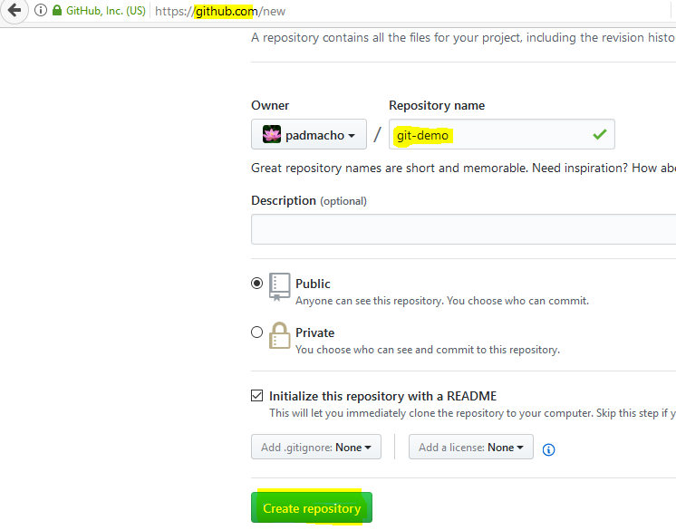

# Quick Start guide

## Create a repository in github
- Login into www.github.com
- In the home screen click to create a repository
- Provide the repo name **git-demo** and click create repository

 

- Repo is created

## Clone the repository to local machine
```bash
vagrant@git-m1:~$ git clone https://github.com/padmacho/git-demo.git
```
```bash
Cloning into 'git-demo'...
remote: Counting objects: 3, done.
remote: Total 3 (delta 0), reused 0 (delta 0), pack-reused 0
Unpacking objects: 100% (3/3), done.
Checking connectivity... done.
```
## Add file to cloned folder
- Change  to folder **git-demo**
- Create file named **Hello.txt**

```bash
vagrant@git-m1:~/git-demo(master)$ echo "Hello" >> Hello.txt
```
```bash
vagrant@git-m1:~/git-demo(master)$ cat Hello.txt
Hello
```
## Add the file to repository
```bash
vagrant@git-m1:~/git-demo(master)$ git add Hello.txt
```
## Commit the file to repository
```bash
vagrant@git-m1:~/git-demo(master)$ git commit -m "Hello file is comitted"
```
```bash
[master 7f84bd4] Hello file is comitted
 Committer: vagrant <vagrant@git-m1>
 1 file changed, 1 insertion(+)
 create mode 100644 Hello.txt
```
## Push the file to github
```bash
vagrant@git-m1:~/git-demo(master)$ git push                                    
```
```bash
Username for 'https://github.com': padmacho                                    
Password for 'https://padmacho@github.com':                                    
Counting objects: 3, done.                                                     
Compressing objects: 100% (2/2), done.                                         
Writing objects: 100% (3/3), 280 bytes | 0 bytes/s, done.                      
Total 3 (delta 0), reused 0 (delta 0)                                          
To https://github.com/padmacho/git-demo.git                                    
   cb5b46c..7f84bd4  master -> master                                          
```
## [Git Home](index.html)
