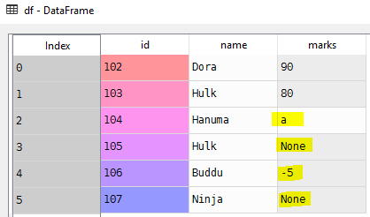
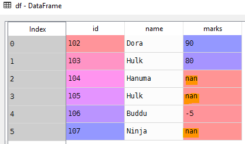

# Data Cleansing
Unfortunately, it is very common in data analysis that the input data is not perfect, and it often requires cleaning.
# Sample DataFrame
```python
import pandas as pd

# List of student tuples with id,name and marks
students = [(102, 'Dora', 90), (103, 'Hulk', 80),
            (104, 'Hanuma', 'a'), (105, 'Hulk',),
            (106, 'Buddu', -5), (107, 'Ninja',)]
# Create a data frame from records
df = pd.DataFrame.from_records(students)

# Set column names
df.columns = ['id', 'name', 'marks']
```
# Missing Data

# Empty values points
- Pandas convert empty values to Nan

Using **to_numeric** convert all the strings to numeric data type
```Python
# Try to convert all the elements in the column to numeric
pd.to_numeric(df['marks'])
>>>
ValueError: Unable to parse string "a" at position 2
```
```Python
# Force pandas to convert String or None to NaN
pd.to_numeric(df['marks'], errors='coerce')
>>>
0    90.0
1    80.0
2     NaN
3     NaN
4    -5.0
5     NaN
```
```Python
# Update the marks column
df['marks'] = pd.to_numeric(df['marks'], errors='coerce')
```


# Source
- [Data-Cleansing.py](Data-Cleansing.py)

# [Python Home](index.html#Data-cleansing)
