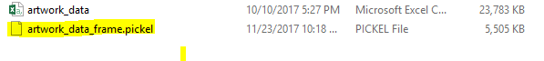

# Data Source for Pandas
Data formats that pandas can read and load to DataFrame
- Text
    - CSV (Comma Separated Values).It's good to know that the separator does not always have to be a comma
    - JSON (Java Scrip Object Notation). Widely used on the web, hierarchical format in which we can nest objects
    - HTML tables - Read data from webpages
- Binary
    - Binary, this form has become most useful when you need to work with other software formats. This allows data interchanged between Pandas, and for example, Excel, SaaS, and Stata software
- Data base
    - Read data from all major relational databases, so if you have some data stored there you can read it with SQL query

# Read a csv file
```Python
import pandas as pd

# Read only five rows from csv file
df = pd.read_csv(r"d:\artwork_data.csv", nrows=5)
```
Note: Default index coloum is provided by Pandas

Lets set **id** column as index
```Python
# Set index column as id
df = pd.read_csv(r"d:\artwork_data.csv", nrows=5,
                 index_col='id')

```

```Python
# Limit number of columns
df = pd.read_csv(r"\artwork_data.csv", nrows=5,
                 index_col='id', usecols=['id', 'artist'])

```

```Python
COLS_TO_USE = ['id', 'artist', 'title', 'medium', 'year', 'acquisitionYear', 'height', 'width', 'units']

df = pd.read_csv(r"D:\artwork_data.csv", nrows=5,
                 index_col='id', usecols=COLS_TO_USE)
```


# Creating data frame from dictionaries and tuples
Using **pd.DataFrame.from_*** can be used to convert dict and tuple objects to data frame
```Python
>>> import pandas as pd                       
>>> # student and marks in english            
... marks = [("dora", 90), ("spiderman", 40)] # List of tuples
>>> df = pd.DataFrame.from_records(marks)     
```
```python
>>> df
           0   1
0       dora  90
1  spiderman  40
```
Creating columns
```Python
>>> df.columns=['name','marks']
>>> df
        name  marks
0       dora     90
1  spiderman     40
```

# Write the data DataFrame
 Write the data frame to pickle format. **pickle** is a native Python format for serialization. If you are not familiar with the term serialization, in our case, it just means writing and reading Python objects to and from a disk.
```Python
# Write data frame to pickle format
df.to_pickle(r"D:\artwork_data_frame.pickel")
```

# [Python Home](index.html#Inputs-to-DataFrame)
