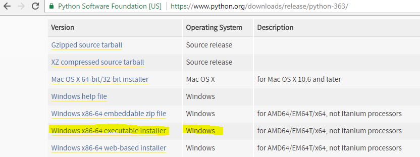
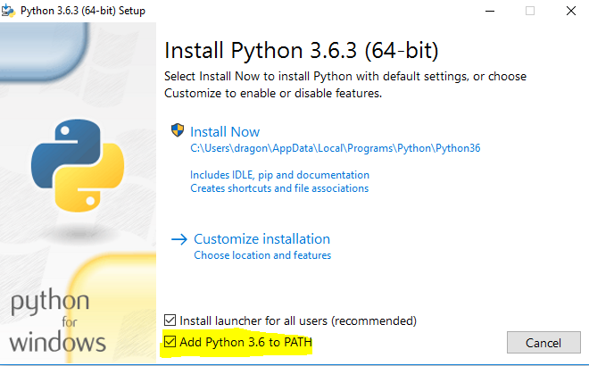
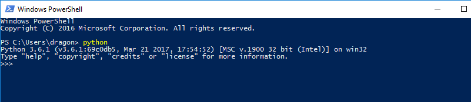

# Installation on Windows 10
For Windows, you need to visit the official Python website at python.org and then, navigate via the Downloads tab to the Downloads for Windows and click the button to begin downloading the latest Python 3 version
# Video
<iframe width="560" height="315" src="https://www.youtube.com/embed/6lyN8Bgey7k?rel=0" frameborder="0" allowfullscreen></iframe>
# Download the executable installer
https://www.python.org/downloads/release/python-363/



Direct link: https://www.python.org/ftp/python/3.6.3/python-3.6.3-amd64.exe

# Start the Installation
Double click the installation to start

- Be sure to enable the option to add Python to the PATH environment variable before moving on, by clicking Install Now.


# Python version
Once the installation is finished, Go to command prompt and  type **python --version** in command prompt. This shows python installation is successful and python is added to your PATH
```command
C:\Users\dragon>python --version
Python 3.6.1
```
# Start python REPL
Go to  windows power shell or comamnd prompt and type python

Power Shell on Windows


Command Prompt on Windows


# [Python Home](index.html#InstallWindows)
