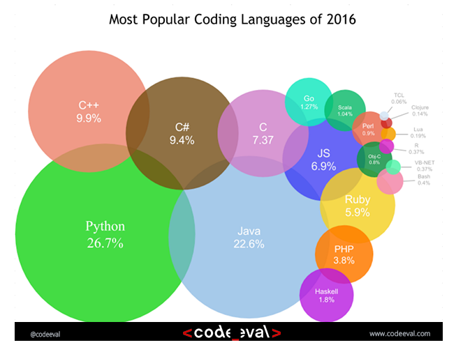

# Why should we learn Python?

# What is so great about Python?
-  Python language is expressive and productive so you can create solutions quickly
-  Python comes with a great standard Library
-  Python has rich community

# Introduction
- Python is a widely used high-level programming language for general-purpose programming
- Created by **Guido van Rossum** and first released in 1991.
- An interpreted language
- Python has a design philosophy that emphasizes code readability (notably using whitespace indentation to delimit code blocks rather than curly brackets or keywords), and a syntax that allows programmers to express concepts in fewer lines of code than might be used in languages such as C++ or Java

# What are the areas python is used?
It is hugely popular in several domains
- Web Application development
    - Django
    - Flask
    - Pyramid
- Scientific computing
    - Astropy
    - Biopython
    - SciPy
- Cloud configuration
    - Ansible (Python based tool for configuration Management)
    - Boto for Amazon Web Services
    - Microsoft's Azure Software Development Kit for Python
- Data science and Machine learning
    - Numpy
    - Pandas
    - Matplotlib
    - Bokeh
    - TensorFlow

# Python is open source
- Python is open source.
- Python is hugely popular and has a great community to support you when you run into trouble

# Python Features
- Interpreted language
- Dynamic type system
- Automatic memory management
- Multiple programming paradigms
    - object-oriented
    - Imperative
    - Functional programming
    - Procedural styles

# Python Versions
- Python 2.x is legacy
- Python 3.x is the present and future of the language.

“The most visible (difference) is probably the way the “print” statement works. It's different enough that the same script won't be able to run on both versions at the same time, but pick one and you'll be fine.”

Essentially, the print statement has been replaced with a print () function.

Python 2
```Python
print "I am python 2"
```
Python 3
```Python
print("I am python 3")
```

# [Python Home](index.html)
