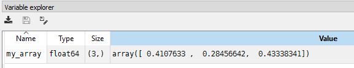

# Useful functions in Numpy
# Create a numpy array
Create a numpy array with random elements
```Python
import numpy as np
my_array=np.random.rand(3)
print(my_array)
```
```Python
[ 0.87730866  0.17164441  0.93822828]
```

Notice: my_array is of type **numpy.ndarray** and with three elements of Type of type **float64** and size 3

# Read elements from numpy array
Element of numpy array can be accessed using **index**
```Python
# Read element in the array using index
my_array[0]
>>>
0.59382282106091899
```
# Source code
- [Numpy-Introduction](Numpy-Introduction.py)

# [Python Home](index.html#Numpy-Introduction)
