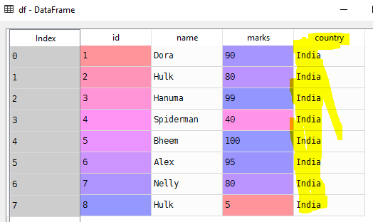

# Operations on DataFrame
Common operations on Data Frame
# Create data frame
```python
import pandas as pd

# List of student tuples
students = [(1, 'Dora', 90), (2, 'Hulk', 80), (3, 'Hanuma', 99), (4, 'Spiderman', 40), (5, 'Bheem', 100),
            (6, 'Alex', 95), (7, 'Nelly', 80)]
# Create data frame from students
df = pd.DataFrame.from_records(students)

# Set column names
df.columns = ['id', 'name', 'marks']

```

# Selecting column
```Python
# Select name column
df['name']
# other way of selecting name column but don't use it
df.name
>>>
0         Dora
1         Hulk
2       Hanuma
3    Spiderman
4        Bheem
5         Alex
6        Nelly
7         Hulk
# Selecting multiple column
df[['name', 'marks']]
>>>
name  marks
0       Dora     90
1       Hulk     80
2     Hanuma     99
..   .....       ...
```
# Value counts
Find number of times a value occurred in a column
```Python
# Gives number of occurrences of element in column
df['name'].value_counts()
>>>
Hulk         2
Dora         1
Hanuma       1
Bheem        1
Spiderman    1
Nelly        1
Alex         1
```
Note: **Hulk** occurred twice in our data set
# top and bottom elements in a column
head() and tail() methods can be used to get top and bottom elements in a column
```Python
# Get top 5 elements in a column
df['name'].head()
>>>
0         Dora
1         Hulk
2       Hanuma
3    Spiderman
4        Bheem
```
```Python
# Get bottom 5 elements in a column
df['name'].tail()
>>>
3    Spiderman
4        Bheem
5         Alex
6        Nelly
7         Hulk
```
# Selecting unique elements in column
```Python
# find unique elements in column
pd.unique(df['name'])
>>>
array(['Dora', 'Hulk', 'Hanuma', 'Spiderman', 'Bheem', 'Alex', 'Nelly'], dtype=object)
```
Notice **Hulk** appeared only once in the list

# Data Filtering
Finding column that has name **Hulk**
```Python
# Filter columns that has name as 'Hulk'
df['name'] == 'Hulk'
```
```Python
id
1    False
2     True
3    False
4     True
Name: name, dtype: bool
```
# Adding a column
Add a column using **assign** method
```Python
# Adding a column named country
df = df.assign(country='India')
```
Note: **country** is a column name :)


# Deleting a column
del operator can be used to drop a column
```Python
# Delete a column in data frame
del df['country']

print(df)
>>>
id       name  marks
0   1       Dora     90
1   2       Hulk     80
2   3     Hanuma     99
3   4  Spiderman     40
......................
```
# Arithmetic Operations on columns
```Python
# Arithmetic operations on data frame
# Create a data frame
rectangles = [('rect1', 10, 20), ('rect2', 15, 20)]
df1 = pd.DataFrame.from_records(data=rectangles, columns=['id', 'length', 'breath'], index=['id'])
>>>
id   length  breath
rect1      10      20
rect2      15      20

# Create a area column
df1 = df1.assign(area=df1['length'] * df1['breadth'])
>>>
id       length  breadth  area
rect1      10       20   200
rect2      15       20   300
```
# max and idmax
max- Returns maximum value in the column
idxman- Returns the index of element with maximum value
```Python
# Get maximum area
df1['area'].max()
>>>
300
# Get row with maximum area
df1.loc[df1['area'].idxmax(), :]
>>>
length      15
breadth     20
area       300
```
# Source code
- [Operations-on-DataFrame.py](Operations-on-DataFrame.py)

# [Python Home](index.html#Operations-on-DataFrame)
