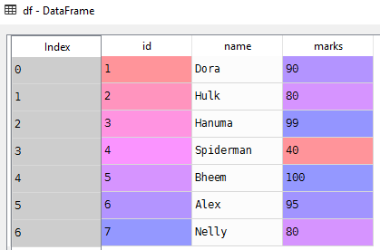

# Operations on DataFrame
Common operations on Data Frame
# Create data frame
```python
import pandas as pd
# List of student tuples with id,name and marks
students = [(1, 'Dora', 90), (2, 'Hulk', 80), (3, 'Hanuma', 99), (4, 'Spiderman', 40)]
# Create a data frame from records
df = pd.DataFrame.from_records(students)

```

# Set columns and index
```Python
df.columns=['id','name','marks'] # Set column names
df.set_index('id',inplace=True) # Set id column as index
```

# Selecting column
```Python
# Select name column
df['name']
# other way of selecting name column but don't use it
df.name
```
```Python
id
1      Dora
2      Hulk
3    Hanuma
4      Hulk
Name: name, dtype: object
```
# Selecting unique elements in column
```Python
# Select unique elements in  name column
pd.unique(df['name'])
```
Notice **Hulk** appread only once in the list
```Python
 array(['Dora', 'Hulk', 'Hanuma'], dtype=object)
```
# Data Filtering
Finding column that has name **Hulk**
```Python
# Filter columns that has name as 'Hulk'
df['name'] == 'Hulk'
```
```Python
id
1    False
2     True
3    False
4     True
Name: name, dtype: bool
```
# Number of elements in a column
```python
len(df['name'])
```
```Python
>>> 4
```
```Python
# occurrence of each element in the column
df['name'].value_counts()
```
```Python
Hulk      2
Dora      1
Hanuma    1
Name: name, dtype: int64
```
```python
# Occurrence of Hulk in the column
s = df['name'].value_counts()
s['Hulk']
```
```Python
>>> 2
```

# Source code
- [data_frame_from_records.py](data_frame_from_records.py)
# [Python Home](index.html#Operations-on-DataFrame)
