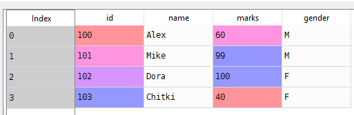

# Pandas Grouping
- Grouping
    - Grouping data on a particular value
- Aggregation
    - Operation in which we group data by some value and return one value for each group is an aggregate operation
- Transformation
    - The process of cleansing the data and filling the missing vaules using statistical approach is called Transformation
- Filtering
  - Dropping data based on a particular condition
# Sample data frame
List of students in a class with marks
```python
# List of students with marks in mathematics subject
students = [(100, 'Alex', 60, 'M'), (101, 'Mike', 99, 'M'), (102, 'Dora', 100, 'F'), (103, 'Chitki', 40, 'F')]
# Create a data frame from  list of tuples
df = pd.DataFrame.from_records(students, columns=['id', 'name', 'marks', 'gender'])

```

# Group by
```python
# Group student by Gender column
grouped_data = df.groupby('gender')

# Know the type of grouped data
type(grouped_data)
>>>
pandas.core.groupby.DataFrameGroupBy
``
Display students grouped by gender
```Python
# iterate through group by data frame
for gender, group_df in grouped_data:
    print(gender)
    print(group_df)
>>>
F
    id    name  marks gender
2  102    Dora    100      F
3  103  Chitki     40      F
M
    id  name  marks gender
0  100  Alex     60      M
1  101  Mike     99      M
```
# Aggregation
Get maximum marks in male
```Python
grouped_data.get_group('M')['marks'].max()
>>>
99
# Using aggregate function and pass numpy max function as argument
grouped_data.get_group('M')['marks'].agg(np.max)
>>
99
```
Prefer to use numpy functions because we will get performance improvement

# Transformation
Lets add one mark to all the students using normal way or **transform** method`
```Python
# Lets add one mark to all the students
df['marks'] = df['marks'] + 1

# define an increment function
def increment(marks):
    return marks + 1

# Apply the increment method to marks column
df['marks'].transform(increment)

```


# Source code
- [Pandas-Grouping.py](Pandas-Grouping.py)
# [Python Home](index.html#Pandas-Grouping)
