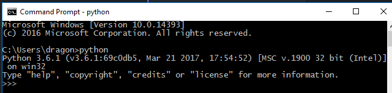

# REPL (Read-Eval-Print-Loop)
It is an interactive development ene. It is a useful tool for experimentation and quick-testing.
In REPL what ever we type in python will read, evaluate it , print the result and loop back to the beginning
# Start REPL
Starting REPL
## Windows
Go to  windows power shell or command prompt and type **python**

## Linux
In the bash shell type **python3** to start repel
```bash
Python 3.5.2                                                                
vagrant@python-m1:~$ python3                                                
Python 3.5.2 (default, Nov 17 2016, 17:05:23)                               
[GCC 5.4.0 20160609] on linux                                               
Type "help", "copyright", "credits" or "license" for more information.      
>>>                                                                     

```
# Performe simple opreation
Type in the expression 1+2 and it is evalulated and result is printed.

# Undrerscore in REPEL
Within the REPL, you can use the special underscore variable to refer to the most recently printed value.
```bash
vagrant@python-m1:~$ python3                                                        
Python 3.5.2 (default, Nov 17 2016, 17:05:23)                                       
[GCC 5.4.0 20160609] on linux                                                       
Type "help", "copyright", "credits" or "license" for more information.              
>>> x=2                                                                             
>>> x                                                                               
2                                                                                   
>>> _ * 3                                                                           
6                                                                                   
>>>                                                                                 
```
Notice **_** contains previously printed value **2**

**Note:** The underscore doesn't have any special behavior in Python scripts or program
# Stop REPL
Sending **End of file** control character will exit the REPEL. Unfortunately, the means of sending this character varies across platforms
## Windows
Ctrl+Z and Enter


## Linux
Ctrl+D will exit the REPL environment
```bash
vagrant@python-m1:~$ python3                                            
Python 3.5.2 (default, Nov 17 2016, 17:05:23)                           
[GCC 5.4.0 20160609] on linux                                           
Type "help", "copyright", "credits" or "license" for more information.  
>>> 1+2                                                                 
3                                                                       
>>>                                                                     
vagrant@python-m1:~$                                                    
                                                                        
```
# [Python Home](index.html)
