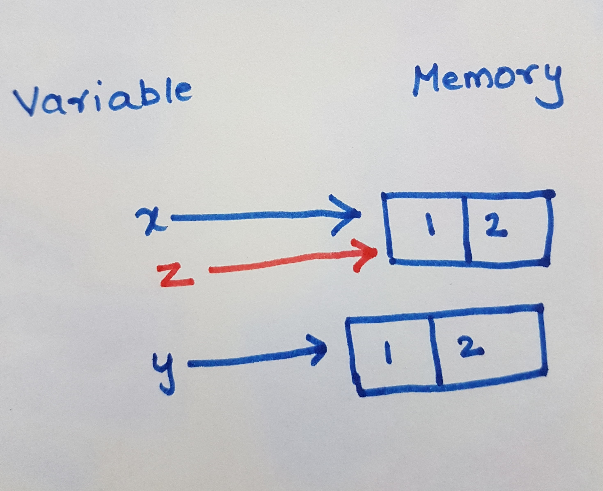

# Relational Operators
Bool values are commonly produced by Python's relational operators, which can be used for comparing objects.

Operator | Description
---| ---
== | value equality
!= | value inequality
<  | less-than
\> |  greater-than
<= | less-than or equal to
\>= |  greater- than or equal to
# Video
<iframe width="560" height="315" src="https://www.youtube.com/embed/uGDvgT4UX9s?rel=0" frameborder="0" allowfullscreen></iframe>

# Examples

```python
>>> i=10  
>>> i==10
True      
>>> i!=10
False     
>>> i<10  
False     
>>> i>10  
False     
>>> i<=10
True      
>>> i>=10
True      
>>>
```
# Object Comparison
**==** two object values are equal
```python
>>> x=[1,2]
>>> y=[1,2]
>>> x==y   
True       
>>> x is y
False      
```
# Reference Comparison
**is** operator can be used to find whether two variables point same reference or not

```python
>>> x=[1,2]
>>> y=[1,2]
>>> z=x
>>> x is y
False
>>> x is z
True
```
Notice: x and z are pointing to same Reference
# Membership operators
**in** is Evaluates to true if it finds a variable in the specified sequence and false otherwise
```python
>>> 2 in [1,2]
True
>>> 3 in [1,2]
False
```  
# [Python Home](index.html#Relational-Operators)
