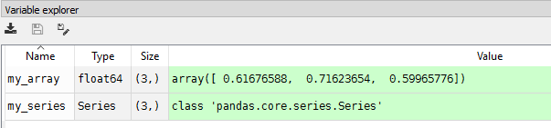
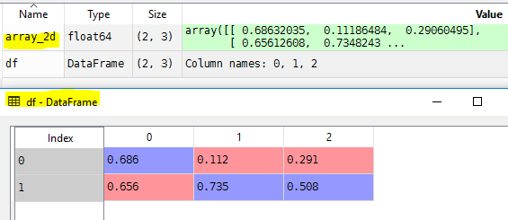
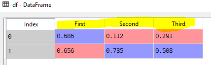

# Series and DataFrames
# Create Pandas series object
Pandas series object can be created from numpy ndarray
```Python
import numpy as np
import pandas as pd

# Create a numpy array
my_array = np.random.rand(3)

# Convert numpy array to series object
my_series = pd.Series(my_array)

# Read an element with index
print(my_series[0])

# Create own indexes
my_series = pd.Series(my_array, index=["First", "Second", "Third"])

# access element with our own index
print(my_series["First"])

```
```bash
0.105328226909
0.105328226909
```


# Properties of series objects
```python
>>> my_series.index
Index(['First', 'Second', 'Third'], dtype='object')
```
**index** is a string representation of index object with data type as object
# Create two dimensional arrays
```Python
import numpy as np

# Create a random array with three rows and two column
array_2d = np.random.rand(3, 2)

```
```python
array_2d # Print array
Out[7]:
array([[ 0.44422621,  0.75277854],
       [ 0.61006535,  0.38934917],
       [ 0.7911938 ,  0.53101575]])

array_2d[0,0] # access element at zero row and zero column
Out[8]: 0.44422620884326713

array_2d[2,1]
Out[9]: 0.53101575313563343

array_2d[2,2] # Access the element which is not available
Traceback (most recent call last):

  File "<ipython-input-10-85e38c704f0e>", line 1, in <module>
    array_2d[2,2]

IndexError: index 2 is out of bounds for axis 1 with size 2
```
Note: Access element like a[row,column] row and column start with zero index

# Create a python data frames
Dataframe can be created from numpy array
```Python
import numpy as np
import pandas as pd

array_2d = np.random.rand(2, 3)
df = pd.DataFrame(array_2d)

```

```python
df[0] # Read element from first column
Out[23]:
0    0.686320
1    0.656126
Name: 0, dtype: float64
df.columns # Access column labels
Out[27]: RangeIndex(start=0, stop=3, step=1)
df.columns=["First","Second","Third"] # Set coloumn labels
```

```python
df.columns
Out[29]: Index(['First', 'Second', 'Third'], dtype='object')
df["Second"] # Access all the elements  in second column
Out[31]:
0    0.111865
1    0.734824
Name: Second, dtype: float64
```
# [Python Home](index.html#Series-and-DataFrame)
