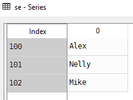

# Series
Series is a one-dimensional **labeled** array capable of holding data of any type (integer, string, float, python objects, etc.). The axis labels are collectively called **index**.

# Dictionaries vs Panda's Series

Dictionaries | Panda's Series
---|---
Allows you to store **key: value** pairs and offer some built-in methods to manipulate your data| These are one-dimensional ndarrays with axis-labels, which allow you to store array-like, dict, or scalar values
If you only need to store some key:value pairs, your best and more elegant solution is to use the default dictionary| If you need to make some complex data manipulation on the stored data, then consider using panda's series
# Create a Series
Create Series object from list and dictionaries
```Python
import pandas as pd

# Create series of students with their ids using lists
se = pd.Series(data=['Alex', 'Nelly', 'Mike'], index=[100, 101, 102])
print(se)

# Create a series from students dict
se = pd.Series(data={100: 'Alex', 101: 'Nelly', 102: 'Mike'})
print(se)
```

# Access data using label (index)
Indexes can be used to retrieve elements in series
```Python
# Access date using index
# Access first element with index
se[100]
>>>'Alex'
```
# Slicing
Series[startIndex:endIndex]. Note **endIndex** element is not retrieved
```Python
# Slicing
# Retrieve all elements
se[:]
>>>
100     Alex
101    Nelly
102     Mike
dtype: object

# Retrieve first element
se[0:1]
>>>
100    Alex
dtype: object
```
# Update an element in series
series[index]=newelement
```Python
# Change Alex to Alexander
se[100] = 'Alexander'
print(se[100])
>>>
'Alexander'
```
# Delete an element in Series
del series[index]
```Python
# delete an element form series
del se[100]
print(se[:])
>>>
101    Nelly
102     Mike
dtype: object
```
# Delete the whole series
del series
```Python
# delete the whole series
del se
```
# Source Code
- [Series.py](Series.py)

# [Python Home](index.html#Series)
