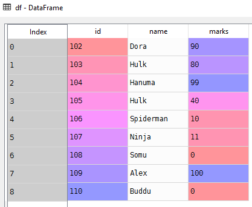

# Sorting Data Frames
Sorting columns in data frame
# Sample data Frame
```Python
# List of student tuples with id,name and marks
students = [(102, 'Dora', 90), (103, 'Hulk', 80), (104, 'Hanuma', 99), (105, 'Hulk', 40)]
# Create a data frame from records
df = pd.DataFrame.from_records(students)

# Set column names
df.columns = ['id', 'name', 'marks']
```

# Sort columns in data frame
```Python
# Sort marks column - Default order is increasing
df['marks'].sort_values()
```
```Python
6      0
8      0
4     10
5     11
3     40
1     80
0     90
2     99
7    100
```
```Python
# Get top 5 values in sorted column
df['marks'].sort_values().head()
```
```Python
6     0
8     0
4    10
5    11
3    40
```
```Python
# Get bottom 5 values in sorted column
df['marks'].sort_values().tail()
```
```Python
3     40
1     80
0     90
2     99
7    100
```
# Source
- [Sorting-DataFrames.py](Sorting-DataFrames.py)

# [Python Home](index.html#Sorting-DataFrames)
