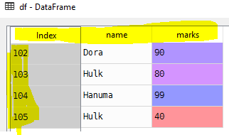

# loc and iloc attributes
- (Select by label) loc works on **labels** in the index.
   - df.loc[row indexer,column indexer]
   - example: df.loc[102,'name']
- (Select by position) iloc works on the **positions** in the index (so it only takes integers)
   - df.iloc[row indexer, column indexer]
   - example: df.iloc[0,0]

# Sample data Frame
```Python
# List of student tuples with id,name and marks
students = [(102, 'Dora', 90), (103, 'Hulk', 80), (104, 'Hanuma', 99), (105, 'Hulk', 40)]
# Create a data frame from records
df = pd.DataFrame.from_records(students)

# Set column names
df.columns = ['id', 'name', 'marks']
# Set id column as index
df.set_index('id', inplace=True)
```


# loc
```Python
# Get student name with id 102
df.loc[102, 'name']
```
```Python
'Dora'
```
```Python
# Get all columns for the row id 102
df.loc[102, :]
```
```Python
name     Dora
marks      90
Name: 102, dtype: object
```
```Python
# Get all rows that has name as 'Hulk'
df.loc[df['name'] == 'Hulk', :]
```
```Python
     name  marks
id              
103  Hulk     80
105  Hulk     40
```
# iloc
```Python
# Get element in first row and first column
df.iloc[0, 0]
```
```Python
'Dora'
```
```Python
# Get all elements in second column
df.iloc[:, 1]
```
```Python
id
102    90
103    80
104    99
105    40
Name: marks, dtype: int64
```
# Slicing data frames
```Python
# Get first two rows and two columns
df.iloc[0:2, 0:2]
```
```Python
     name  marks
id              
102  Dora     90
103  Hulk     80
```
# Arithmetic operations on data frames
```Python
# add one grace mark to every student
df['marks'] = df['marks'] + 1
```
```Python
id
102     91
103     81
104    100
105     41
```
# Source code
- [loc-vs-iloc.py](loc-vs-iloc.py)

# [Python Home](index.html#loc-vs-iloc)
